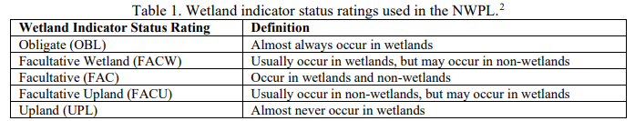

```{r echo=FALSE, message=FALSE, warning=FALSE, results=F}
install.packages("reactable")
library(tidyverse)
library(leaflet)
library(kableExtra)
library(htmlwidgets)
library(widgetframe)
library(dplyr)
library(reactable)
library(crosstalk)
library(sf)
library(mapview)
library(leafem)
library(terra)
knitr::opts_chunk$set(widgetframe_widgets_dir = 'widgets' ) 
knitr::opts_chunk$set(cache=FALSE)  # cached results off
```

# Map Selector

This section allows users to view local wetlands and water features!

```{r echo=FALSE}
town_bound <- read_sf("https://drive.usercontent.google.com/u/0/uc?id=1WScoYQWLa9_jaobUhm-0xcf1MtTaqoE6&export=download")

nysnh_cl <- read_sf("https://drive.usercontent.google.com/u/0/uc?id=1Mjfgt23T8KmxcY5OzBJ0DZ4dgW2jnoHd&export=download")

wetldsum <- rast("data/WtldSumVal1_8.tif")
wetldunion <- read_sf("https://drive.usercontent.google.com/u/3/uc?id=1yNnPViAN8-cjZ38yrhCgsEoaqXd_Un9z&export=download")

town_bound <- st_transform(town_bound, crs = 4326)
nysnh_cl <- st_transform(nysnh_cl, crs = 4326)
wetldunion <- st_transform(wetldunion, crs = 4326)
wetldsum <- project(wetldsum, "EPSG:4326")

soil_names <- (unique(wetldunion$SOIL_NAME))

bins1 <- 0:10

wetldsumpal <- colorNumeric(palette = "viridis", domain = values(wetldsum), na.color = "transparent")

wetldpallette <- colorBin(palette = "inferno", domain = wetldunion$Wetld_Wgt,  bins = bins1, na.color = "transparent")
wetldlabel<-  paste( sep= "<br/>", wetldunion$SOIL_NAME, wetldunion$HYDRICSTAT)
#soils_pal <- colorFactor(palette = "turbo", domain = soil_names, na.color = "transparent")
```

```{r, echo=FALSE, fig.width=6, fig.heigt=3, fig.cap="Map of Wetland Files"}
m <- leaflet(town_bound) %>%
  addTiles() %>% # Add a default base layer
  addPolygons(data = town_bound, group = "Amherst Boundary", stroke = TRUE, color = "black", fill = FALSE, weight = 3) %>%
  addPolygons(data = wetldunion, group = "Soil and Wetland Value", color = "gray", weight = 1, fillOpacity = 0.5, fillColor = ~wetldpallette(Wetld_Wgt), label = lapply(wetldlabel, htmltools::HTML),highlightOptions = highlightOptions(weight = 3, color = "white", bringToFront = TRUE)) %>%
  addPolygons(data = nysnh_cl, group = "Significant Wetland", color = "gray", weight = 1, fillOpacity = 0.5, fillColor = "yellow") %>%
#  addHomeButton(
#    ext = town_bound,
#    group = "Home",
#    position = "bottomright"
#  ) %>%
  addRasterImage(wetldsum, group = "Wetland Proximity", colors = wetldsumpal, opacity = 0.8) %>%
  addLegend(position = "bottomright", group = "Value Legend", pal = wetldpallette, values = wetldunion[[4]], title = "Wetland Value (0-10)", opacity = 1) %>%
  addScaleBar(position = c("bottomleft"), options = scaleBarOptions(maxWidth = 100, imperial = TRUE, updateWhenIdle = FALSE)) %>%
  addLayersControl(
    baseGroups = c("OSM (default)"),
    overlayGroups = c("Amherst Boundary", "Significant Wetland", "Soil and Wetland Value", "Wetland Proximity", "Value Legend"),
    options = layersControlOptions(collapsed = TRUE)
  )%>%
hideGroup("Wetland Proximity")
m

```


# Plant Selector

**Please use the search bars in any column to filter your data!**
Reminder, plants should be carefully considered if they are appropriate for one's needs. This page seeks to diversify thoughts and choices about native plants in gardens; do not blindly choose one. Please be aware some of these plants have natural defenses like thorns, irritating sap, or inedible fruits!

Suggestions are organized by species, common name, wetland status, growth type, and duration.

```{r echo=FALSE}
native2_cleaned <- read.csv("data/native2_cleaned.csv")
# Create SharedData object from the CLEANED data

# beware error due to unclear growth habit names
native3 <- SharedData$new(native2_cleaned)
```

**Take note of the Wetland Codes below!**



```{r echo=FALSE, interactive-table}
bscols(
  widths = NA,
  list(
    filter_checkbox("Gth_Hbt", "Growth Habit", native3, ~Growth.Habit),
    filter_slider("CoC", "Difficulty", native3, ~Difficulty, width = "100%"),
    filter_select("Drt", "Duration", native3, ~Duration)
  ),
  reactable(native3, searchable = TRUE, minRows = 10)
)

```

